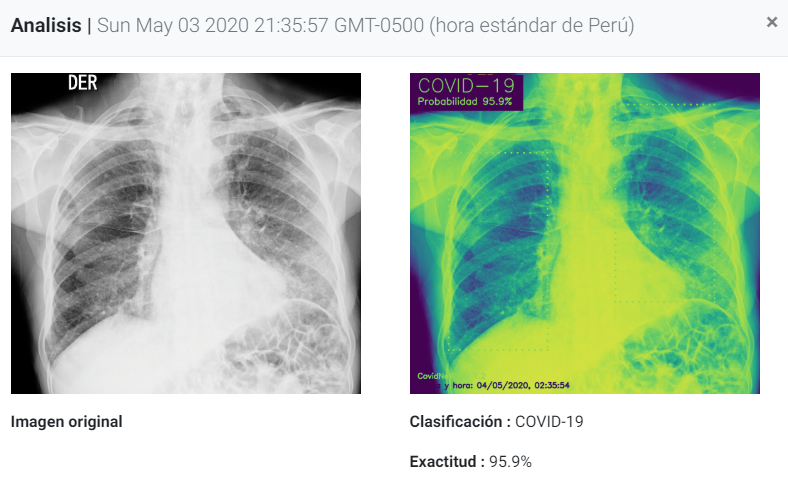
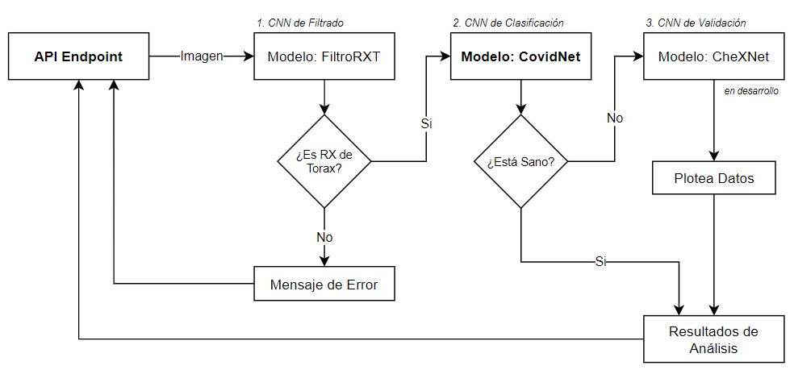
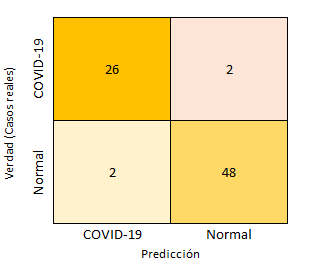

# CovidNet-Perú [![CCLicence][cc-img]][cc]
> Una propuesta de desarrollo colectivo para el diagnóstico temprano de COVID-19.

Se trata de una tecnología open source basado en un modelo de redes neuronales convolucionales (CNN-Deep Learning) para el pre-diagnóstico del COVID-19 usando imágenes radiográficas del tórax.

[cc-img]:      https://licensebuttons.net/l/by-nc-sa/4.0/80x15.png
[cc]:          https://creativecommons.org/licenses/by-nc-sa/4.0/

## Presentación

Tiempos críticos merecen cambios disruptivos, una gobernanza abierta y colaborativa que acelere el desarrollo tecnológico  de softwares libres para la democratización del conocimiento, promoviendo la innovación continua a partir de una política de acceso abierto. 

El uso de **Tecnologias Libres** debe ser aplicada en plena crisis sanitaria y tiempo de transformación digital (la llamada 4ta Revolución Industrial), razones por la que nace [COVIDNetPerú](https://hackactivistas.org/covid19/). Una propuesta open source para la asistencia inteligente en el pre-diagnóstico ("test screening") de COVID-19, usando imagenes radiográficas de tórax.

Nuestro software se trata de una iniciativa de ciencia ciudadana (autogestión colaborativa), para la conscientización de la integración cultural como modelo de gobernanza colaborativa entre científicos activistas independientes (o Hackactivistas). la sociedad civil y los gobiernos locales articulando un ecosistema de gobernanza social-equitativa. 

La reprogramación de nuevas organizaciones societarias emergen en cada crisis político-económica, en este contexto, nuestras naciones a nivel mundial tienen la oportunidad de liderar la **innovación social digital**, una economía orientada a los bienes comunes desde una política de libre cooperación entre redes autónomas (o microestados) hiperconectadas. 

## Descripción del proyecto
El COVID-19 ha impactado en el Perú en tres niveles: sanitario, educativo y económico, ocupando el segundo país de Latinoamérica con el mayor número de infectados confirmados por COVID-19 (+30 mil casos y una aperente tasa de letalidad del 2.8%). Venimos arrastrando una deficiencia en nuestro sistema de salud que retrasa nuestra contingencia. Soto A (2019) [1], describe como tales barreras afectan la atención eficaz en los hospitales de referencia del Ministerio de Salud, la falta de **equipos tecnológicos** modernos para el diagnóstico temprano y un tratamiento oportuno. 

Siendo ese el principal desafío para las enfermedades emergentes infecto-contagiosas, como el COVID-19, desarrollando métodos diagnósticos tan rápidos como efectivos. La prueba molecular PCR (el test gold standard) para COVID-19 presenta una sensibilidad variable entre el 37-71% [2], esta viene siendo complementada por las pruebas “rápidas” (test serológicos) que, a diferencia del gold standard, cuya sensibilidad aumenta con el tiempo demostrando un 33.3% recién en la segunda semana  [3]. 

Es así que planteamos enfatizar el rol del triaje en el protocolo de atención a persona con sospecha de COVID-19 de la Organización Mundial de la Salud, como una medida post-cuarentena, así agilizar la identificación y el monitoreo de nuevos casos de contagio. Tal como se hizo en Codogno (Italia) implementando un **test screening** en zonas de alto riesgo de transmisión comunitaria, tras intervenir a asintomáticos o mínimamente sintomáticos usando radiografías de tórax (rxtx) como método pre-diagnóstico [4]. 

Nuestra propuesta CovidNet-Perú surge como una solución tecnológica que facilitaría la labor de triaje a través de la asistencia inteligente para la rápida identificación y vigilancia de personas infectadas por el nuevo coronavirus. Esta tecnología libre se presenta como una alternativa de bajo costo, fácil acceso y confiable lo cual permite la reducción del burnout en el personal médico. 

## Resultados Previos

Hemos generado una validación previa del modelo de inteligencia artificial, basado en el desarrollo de un estudio previo (https://github.com/lindawangg/COVID-Net), utilizando 1635 imágenes radiográficas clasificadas como i) rx normal, ii) rx neumonía y iii) rx COVID. 

En tal sentido, logramos re-entrenar nuestro modelo con dicha dataset añadiendo imagenes de casos locales, además, hemos robustecido al modelo con nuevos filtros de discriminación que permite identificar solo rxtx entre cualquier otro tipo de imagen. Nuestra solución integra tres componentes de identificación (o modelos de redes neuronales convolucionales - CNN): el modelo de discriminación de imágenes radiográficas, el modelo de detección de radiografías tipo neumonía viral relacionadas a COVID-19 y, por último, el modelo de validación que permite verificar lesiones respiratorias adicionales (aún en desarrollo). 

De este modo fue diseñada la arquitectura de nuestro algoritmo COVIDNet-Perú. Adicionalmente hemos programado una interfaz chatbot en Facebook Messenger donde mediante preguntas se van ponderando las respuestas en base a los criterios clínicos-epidemiológicos para un correcto triaje prevío al analisis por IA. 

Con el fin de comprobar la veracidad del pre-entrenamiento, hemos generado un primer análisis a partir de resultados obtenidos de 78 imagenes radiográficas de tórax, se respetó el carácter anónimo de los pacientes. 

#### Tabla de imágenes totales 
| Casos  | Cantidad |
|   --   |    --    |
| COVID-19 confirmados   | 28 imágenes |
| Normales (sin Covid-19)| 50 imágenes |

Todas las imágenes obtenidas fueron entregadas bajo dos tipos de clasificación: 1) imágenes rx normales (sin presencia de hallazgos radiográficos relacionados a COVID-19) y 2) imágenes rx COVID-19 (con patrón radiológico relacionado a neumonia viral), según los radiologos se trata de una opacidad bilateral con forma de "vidrio escarchado", dispuesto en zonas periféricas y posteriores de los pulmones, estos son patrones inespecíficos de las enfermedades respiratorias intersticiales [6]. 

#### Tabla de imágenes categorizadas
| Casos|Normal| Neumonia | COVID-19|
|     --      |  --  |  --- |  --  |
|  **Normal** | TN=48|  0   | FP=2 |
| **Neumonia**|  0   |  0   |  0   |
| **COVID-19**| FN=2 | TP=5 | TP=21|

Nuestro modelo CovidNet-Perú clasificó las imágenes entregadas en tres categorías: (50) normal, (5) neumonia y (23) Covid-19. Reconociendo 5 casos con neumonía de las imágenes reportadas como COVID-19, los resultados indican una diferencia diagnóstica importante para identificar la causa de la lesión subyacente al patrón neumónico [7], sin embargo, ambos resultados advierten una intervención terapéutica allende su patogénesis.

#### Matriz de Confusión 

Así mismo, hemos reconocido en nuestra matriz de confusión las limitaciones de nuestro modelo, al descubrir dos casos como falsos positivos (FP) y otros dos como falsos negativos (FN). Las imágenes FP y FN demuestran dos escenarios por mejorar tanto el aumento del tamaño de muestras radiográficas analizadas como también la mejora en la calidad de imágenes (con supervisión de profesionales en radiología), ya que son parámetros de interés que limitan la precisión del modelo actual.

#### Tabla de indicadores 
|   Métrica     | Operaciones |  %  |
|       --      |      --     |  -- |
| Exactitud     | (48+26)/78  |94.9 |
| Sensibilidad  | 26/(2+26)   |92.9 |
| Especificidad | 48/(48-2)   |96.0 |

>Descarga de Modelos Pre-Entrenados
Posterioemente estaremos compartiendo las versiones mejoradas del actual modelo y la actualización de la dataset: 
https://drive.google.com/open?id=1gVKGlwxkvhG2yPY6IGV77ECXH9705nfM
*Antes de ejecutar es necesario descomprimir los archivos de cada modelo dentro de las sub carpetas correspondientes ubicada en la carpeta principal "modelos/"*.

## Propuesta de Desarrollo Colectivo

Para llevar a cabo el desarrollo de este software inteligente nos basaremos en tre hitos, los mismos que responden a nuestros tres objetivos específicos:

- Validación del modelo de inteligencia artificial mediante las redes neuronales convolucionales utilizando imágenes radiográficas de tórax. 
- Implementación de un agente conversacional (chatbot) de orientación ciudadana para el triaje clínico-epidemiológico.
- Desarrollo del sistema integrado para la automatización diagnóstica de COVID-19 en el servicio de radiología.

La base para lograr un sistema integral inteligente (https://github.com/minskylab/asclepius), se fundamenta en la modularidad, la escalabilidad, la distribución y el data-driven. Siguiendo esos lineamientos la visión detrás de nuestro software inteligente podremos alcanzar la transformación tecnológica a gran escala para completar la brecha digital que tiene el sistema de salud en el país. 

	

## Referencias

1. Soto A. Barreras para una atención eficaz en los hospitales de referencia del Ministerio de Salud del Perú: atendiendo pacientes en el siglo XXI con recursos del siglo XX. Revista Peruana de Medicina Experimental y Salud Publica. 2019 Jun;36(2):304–11.
2. Rubin GD, Ryerson CJ, Haramati LB, Sverzellati N, Kanne JP, Raoof S, et al. The Role of Chest Imaging in Patient Management during the COVID-19 Pandemic: A Multinational Consensus Statement from the Fleischner Society. Radiology. 2020 Apr 7;201365. 
3. Vidal-Anzardo M, Solis G, Solari L, Minaya G, Ayala-Quintanilla B, Astete-Cornejo J, et al. Evaluación en condiciones de campo de una prueba serológica rápida para detección de anticuerpos IgM e IgG contra SARS-CoV-2. Revista Peruana de Medicina Experimental y Salud Pública [Internet]. 2020 Apr 21 [cited 2020 Apr 26];37(2). Available from: https://rpmesp.ins.gob.pe/index.php/rpmesp/article/view/5534
4. Bandirali M, Sconfienza LM, Serra R, Brembilla R, Albano D, Pregliasco FE, et al. Chest X-ray findings in asymptomatic and minimally symptomatic quarantined patients in Codogno, Italy. Radiology. 2020 Mar 27;201102. 
5. Wang L, Wong A. COVID-Net: A Tailored Deep Convolutional Neural Network Design for Detection of COVID-19 Cases from Chest X-Ray Images. arXiv:200309871 [cs, eess] [Internet]. 2020 Apr 15 [cited 2020 Apr 26]; Available from: http://arxiv.org/abs/2003.09871
6. Giménez Palleiro A, Franquet T. Patrones radiológicos en la enfermedad pulmonar intersticial. Semin Fund Esp Reumatol. 2013 Oct 1;14(4):97–105. 
7. Ye Z, Zhang Y, Wang Y, Huang Z, Song B. Chest CT manifestations of new coronavirus disease 2019 (COVID-19): a pictorial review. Eur Radiol [Internet]. 2020 Mar 19 [cited 2020 May 6]; Available from: https://doi.org/10.1007/s00330-020-06801-0

**Recursos adicionales:** https://github.com/aildnont/covid-cxr

--- 
>¿Deseas ser parte nuestra comunidad Hackactivista o deseas implementar nuestro modelo en tu centro de salud? Contáctanos: ialab@hackactivistas.org.

Equipo de investigación y desarrollo: 
- edronald7@gmail.com, 
- jhosepvega2015@gmail.com, 
- samuel.electronica@gmail.com, 
- bregymr@gmail.com, 
- ale.1010@live.com,
- david.chaupis.m@upch.pe,

## [Forking the government!](https://www.wired.co.uk/article/taiwan-sunflower-revolution-audrey-tang-g0v)
